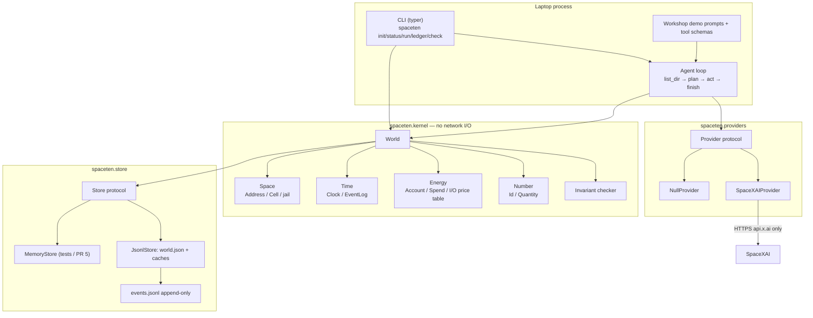
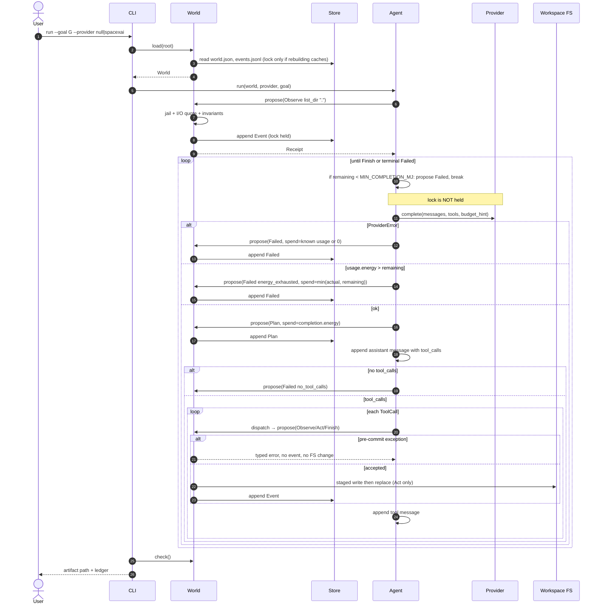
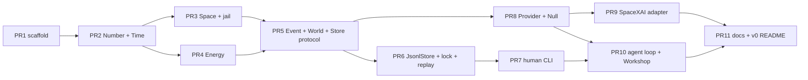

# SpaceTEN Design Document

| Field | Value |
| --- | --- |
| **Title** | SpaceTEN: a four-primitive kernel for open agent work |
| **Author** | OpenAgent / Eric Josh Eidem |
| **Date** | 2026-08-15 |
| **Status** | Accepted (owner signed off 2026-08-15) |
| **Target repo** | [github.com/OpenAgent/SpaceTEN](https://github.com/OpenAgent/SpaceTEN) |
| **Default branch** | `main` |
| **Verified HEAD** | `2327262e54ad25a72cf29af4a8cdfd4c3c6c1976` (`Initial commit`) |

This document is the first design for a greenfield repository. It is written so a single author can implement v0 on a laptop, then land incremental PRs that future contributors can review independently.

---

## Overview

SpaceTEN (Space, Time, Energy, Number) is an open-source **kernel + CLI** for agent work. It does not start as a chatbot product, a hosted platform, or a multi-agent operating system. It starts as a local library that treats every agent action as a transaction in four first-class dimensions:

- **Space** — where work and state live (a jailed workspace of addressable cells).
- **Time** — when things happen (a causal event log with logical + wall clocks).
- **Energy** — what it costs to act (a conserved budget spent on I/O, tools, and model calls).
- **Number** — how things are identified and conserved (sortable IDs, quantities, invariants).

v0 is a typed Python package (`spaceten`) and a CLI (`spaceten`) that can initialize a world in any directory, record an append-only event log, refuse illegal actions, optionally call **SpaceXAI** (Grok) behind a vendor-neutral `Provider` interface, and run a small **Workshop** demo: *explore this workspace, stay inside budget, write a result file, print the ledger*. The same demo runs offline with a deterministic Null provider so CI and first-time clones do not need an API key.

As of 2026-08-15 the public repo contains only `README.md` (`# SpaceTEN` / `Space Time Energy Number`). No license, code, issues, topics, or homepage exist. Nothing in this document should be read as describing shipped software.

---

## Background & Motivation

### What exists today

Verified against the public GitHub repo on 2026-08-15:

| Fact | Value |
| --- | --- |
| Owner | GitHub user `OpenAgent` |
| Visibility | Public |
| Files | `README.md` only |
| Stars / issues / topics / homepage | none |
| License | none |
| Commits | 1 (`Initial commit`) |
| Clone URL | `https://github.com/OpenAgent/SpaceTEN.git` |

There is no product thesis in-repo beyond the four-word tagline. There are no users, services, or APIs. The only additional signals used here are (1) the owner identity **OpenAgent**, (2) the stated intent to write a design document and then code, and (3) the instruction that if LLMs appear, the default provider is **SpaceXAI**.

### Why a kernel, not a chat wrapper

Most “agent” repositories are prompt-and-tool loops glued to a vendor SDK. They lose track of *where* the agent is allowed to write, *in what order* claims were made, *what the work cost*, and *which quantities must remain true*. Those four losses map directly onto Space, Time, Energy, and Number.

SpaceTEN’s bet is that an open agent system needs a **physics**, not another orchestrator:

- Agents should not be able to spend more Energy than they have. Networked planners are **bounded before the HTTP call**; attempted cost is always booked.
- Agents should not be able to write outside Space.
- Agents should not be able to rewrite history or act on a missing causal parent.
- Every Event should have a stable Number, and a small set of invariants should be mechanically checkable.

That is useful even when the “agent” is a human typing CLI commands, a fixture-driven Null planner, or a later multi-agent runtime. The LLM is a plugin, not the substrate.

### Pain this v0 is willing to own

| Pain | How v0 addresses it |
| --- | --- |
| Agent runs are unauditable | `events.jsonl` is SoT for *history and Energy*; every run ends in `Finish` or `Failed` |
| Token spend is informal | Conserved Energy account; adapter-computed Plan spend; attempted cost booked even when tools are skipped |
| Tools escape the workspace | Space jail: resolved paths must stay under `world.root` |
| Vendor lock-in | `Provider` protocol; SpaceXAI is the default adapter, not a kernel import |
| Empty repo has no runnable proof | Workshop demo + Null provider + pytest on a laptop |

### Pain this v0 explicitly does not own

Hosted control planes, multi-tenant auth, distributed consensus, a web UI, plugin marketplaces, long-term memory / embeddings, and “an operating system for your life.” Those are later products that can sit *on* the kernel if the kernel is real.

---

## Goals & Non-Goals

### Goals (v0)

1. Ship a Python 3.12+ library and CLI that a clone-and-run contributor can exercise without cloud accounts.
2. Encode Space, Time, Energy, and Number as separate modules with a single `World` facade.
3. Persist a world under `<workspace>/.spaceten/` as JSON + JSONL so the state is inspectable with ordinary Unix tools.
4. Enforce seven invariants on every mutating operation (see [Invariants](#invariants-v0)).
5. Provide two providers: `null` (deterministic, offline) and `spacexai` (default networked planner).
6. Ship one demo (`spaceten run --goal ...`) that reads a workspace, writes one artifact, and prints a ledger.
7. Land the work as independently reviewable PRs into `OpenAgent/SpaceTEN`.

### Non-goals (v0)

- No server, database, Docker dependency, or always-on daemon.
- No multi-agent worlds, no inter-world networking, no CRDTs.
- No shell / subprocess tool (deferred; see Open Questions). v0 tools are `list_dir`, `read_file`, `write_file`, `finish`.
- No embeddings, RAG, browser use, or multimodal generate/edit.
- No attempt to be LangChain / CrewAI / MCP compatible in v0.
- No claim of production SLOs, multi-user tenancy, or existing customers.
- No hard dependency on SpaceXAI (or any vendor) in the kernel or store.

### Success criteria for v0

A contributor on a laptop can do all of the following in under five minutes after `uv sync`:

```bash
spaceten init ./playground --energy 10000
echo "hello" > ./playground/IN.txt
spaceten --root ./playground run --goal "Read IN.txt and write OUT.md summarizing it" --provider null
spaceten --root ./playground ledger
spaceten --root ./playground check
```

`OUT.md` exists, `check` exits 0, `ledger` shows `remaining + spent == cap`, and `events.jsonl` contains Observe / Plan / Act / Finish events (and a terminal `Finish` or `Failed`). A second run with `--provider spacexai` (when `XAI_API_KEY` is set) produces a richer plan but the same kernel path. `--energy 10000` is an explicit smaller cap for the demo; the default cap when the flag is omitted is `100000` mj.

---

## Proposed Design

### Product thesis

**SpaceTEN is the accounting kernel for OpenAgent work.** A *world* is a jailed directory plus a conserved energy budget plus an append-only causal log. Anything that wants to observe, plan, or act — a human, a script, or a Grok-backed loop — does so by proposing an operation to the kernel.

The kernel **either commits an `Event` or rejects with a typed exception and writes nothing**. Those two outcomes are not interchangeable. Pre-commit violations (`OutsideSpace`, `StaleParent`, I/O quote overflow, missing cell, write too large) raise and leave the log and FS unchanged. Post-network outcomes (`ProviderError`, usage that exceeded remaining despite the adapter bound) **commit** a `Failed` event and debit whatever of the attempted cost still fits. See [Commit vs reject](#commit-vs-reject).

The four-letter name is not branding decoration. It is the type system:

| Primitive | Kernel type | v0 concrete form |
| --- | --- | --- |
| Space | `Address`, `Cell`, `Workspace` | POSIX path relative to `world.root`; bytes live on the jailed FS; the log stores hashes |
| Time | `Clock`, `EventLog` | monotonic `seq: u64` assigned by `World` + UTC `wall` from `Clock` + `parent` id |
| Energy | `Energy`, `AccountView`, `Spend` | integer **millijoules** (`mj`); one account per world |
| Number | `Id`, `Quantity` | ULID for identities; `Decimal` for quantities; conserved totals |

### Why this shape (and not a bigger one)

A kernel is the smallest thing that can become the other plausible products later (a simulator, a personal agent OS, a protocol) without throwing away the log. Starting with a game or an OS would force UI, content, and policy work before the conservation laws exist. See [Alternatives Considered](#alternatives-considered).

### Architecture



Rules the diagram is meant to enforce:

- `spaceten.kernel` and `spaceten.store` must not import `spaceten.providers` or any HTTP client.
- `spaceten.providers.spacexai` is the only module that knows `api.x.ai`, `XAI_API_KEY`, or model names.
- The agent loop asks the kernel to commit; it never writes the log itself.
- `Provider.complete` is never called while `.spaceten/lock` is held.

### Runtime sequence: `spaceten run`

The loop is **plan then act**. The first Observe is a real `list_dir(".")`. Provider I/O happens *outside* the world lock.



### On-disk world layout

Created by `spaceten init <dir>`:

```text
<workspace>/
  .spaceten/
    config.toml          # provider prefs only (not energy cap)
    world.json           # World header (id, created_at, root policy, energy_cap)
    energy.json          # cache of AccountView; reconstructable from the log
    cells.json           # hash index (address → sha256, size); NOT file bytes
    events.jsonl         # SoT for history and Energy (append-only)
    lock                 # flock exclusive, mutate paths only
    tmp/                 # crash-safe staging for Act writes
  ... caller files (SoT for bytes) ...
```

`world.json` (illustrative):

```json
{
  "id": "01JABCDEFGHJKMNPQRSTVWXYZ0",
  "schema": 1,
  "created_at": "2026-08-15T17:00:00Z",
  "root_policy": "jail",
  "energy_unit": "mj",
  "energy_cap": 100000
}
```

JSON timestamps are ISO-8601 UTC with a `Z` suffix (`2026-08-15T17:00:00Z`), never `+00:00`. Pydantic serializers on `Event` and `world.json` must emit `Z`.

`events.jsonl` is the source of truth for **history and Energy**. The jailed filesystem is the source of truth for **bytes**. `cells.json` is a hash index only. See [Sources of truth](#sources-of-truth).

v0 scale envelope (single author, laptop):

| Quantity | Target |
| --- | --- |
| Concurrent processes on one world | 1 writer (exclusive lock on mutate); readers are lock-free |
| Events before we care about compaction | 10,000 |
| Bytes per event | ~0.5–2 KiB (hashes, not file bodies) |
| Event log at 10k events | ~5–20 MiB |
| Observe / Act latency (no provider) | < 20 ms p95 on SSD |
| Plan latency | provider RTT; typically 1–30 s for SpaceXAI; lock is not held |
| Default energy cap | 100,000 mj |
| Per-call quote ceiling | `PER_CALL_CEILING_MJ = 8_000` |
| Minimum viable completion | `MIN_COMPLETION_MJ = 8` |
| Max agent steps per `run` | 32 |
| Max write size | `SPACETEN_MAX_WRITE_BYTES` default 1,048,576 |

`8_000` is a **per-call ceiling**, not `cap / max_steps`. It is ≈ 8,000 uncached input tokens or ≈ 2,666 output tokens at the 1:3 table. `32 × 8_000 = 256_000 > 100_000`, so a SpaceXAI run hits Energy, not the step limit. Null Workshop spend is tens of mj, so the step limit is what bounds a stuck Null fixture. `--energy 10000` in the success criteria is a smaller explicit cap, not the default.

Compaction, SQLite, and multi-process writers are deferred.

### Repository layout (proposed; does not exist yet)

```text
SpaceTEN/
  README.md
  LICENSE
  NOTICE
  pyproject.toml
  uv.lock
  .python-version           # 3.12 (CI also runs 3.13)
  .gitignore
  AGENTS.md
  docs/
    DESIGN.md
  src/spaceten/
    __init__.py
    errors.py
    kernel/
      __init__.py
      number.py
      time.py
      space.py
      energy.py
      event.py
      invariant.py
      world.py
    store/
      __init__.py
      protocol.py           # Store protocol
      memory.py             # MemoryStore (PR 5 tests, stays)
      paths.py
      jsonl.py
      state.py
      lock.py
    providers/
      __init__.py
      base.py
      null.py
      spacexai.py
    agent/
      __init__.py
      tools.py
      prompt.py
      loop.py
    cli/
      __init__.py
      main.py
      render.py
    demo/
      workshop.py
  tests/
    conftest.py
    test_number.py
    test_time.py
    test_space.py
    test_energy.py
    test_event.py
    test_invariant.py
    test_world.py
    test_store.py
    test_jail.py
    test_null_provider.py
    test_agent_loop.py
    test_cli.py
  examples/
    workshop/
      IN.txt
      README.md
  .github/workflows/ci.yml
```

Packaging: `hatchling` via `uv`. Import name and script name: `spaceten`. Requires-Python: `>=3.12`. CI matrix is **3.12 and 3.13** on `ubuntu-latest` and `macos-latest`. Windows is best-effort and not in CI.

`pyproject.toml` declares the extra in PR 1 so later PRs do not thrash it:

```toml
[project.optional-dependencies]
spacexai = ["xai-sdk"]
```

### The four primitives

#### Number (`src/spaceten/kernel/number.py`)

Identities are **ULIDs** (Crockford base32, 26 chars, time-sortable). Quantities are `decimal.Decimal` with a fixed exponent of 0 for Energy (integer mj) and a configurable exponent for future commodity counts.

```python
from dataclasses import dataclass
from decimal import Decimal
from typing import NewType

Id = NewType("Id", str)          # ULID
Seq = NewType("Seq", int)        # monotonic per world, starts at 1

@dataclass(frozen=True, slots=True)
class Quantity:
    value: Decimal
    unit: str                    # "mj" | "count" | "byte"

    def __post_init__(self) -> None:
        if self.value < 0:
            raise ValueError("quantities are non-negative; use directed Spend")
```

`Id` generation is injected (`IdFactory`) so tests can be deterministic. Production factory: `ulid-py` or a 16-line ULID encoder. Do not use random UUIDv4 for events — they destroy Time order in the Number itself.

#### Time (`src/spaceten/kernel/time.py`)

```python
class Clock:
    def now(self) -> datetime:
        """Timezone-aware UTC wall time. Tests inject a frozen clock."""
```

`Clock` returns **wall time only**. It does not assign `seq` or `parent`. `seq` is assigned by `World.propose` at commit, never by the caller.

`parent` on `propose`:

- `parent=None` (the default) means **use the current head**. On an empty log this is genesis (`parent=None` on the committed `Init`). On a non-empty log the committed event’s `parent` is `head.id`.
- `parent=<Id>` is the stale-writer test API: if it is not equal to the current head, raise `StaleParent` and write nothing.

This is single-writer optimistic concurrency, not distributed consensus. The exclusive lock already serializes writers; explicit `parent=` exists so tests can prove `StaleParent`.

Genesis event: `op=Init`, `parent=None`, `seq=1`, `energy_cap_mj` set.

#### Space (`src/spaceten/kernel/space.py`)

```python
@dataclass(frozen=True, slots=True)
class Address:
    path: str                    # POSIX, relative, no leading '/'

    def parts(self) -> tuple[str, ...]: ...

@dataclass(frozen=True, slots=True)
class Cell:
    address: Address
    kind: Literal["file", "dir"]
    content_hash: str | None     # sha256 hex of file bytes; None for dir
    size_bytes: int
    mtime_wall: datetime | None

class Workspace:
    def __init__(self, root: Path, *, max_write_bytes: int = 1_048_576) -> None: ...
    @property
    def max_write_bytes(self) -> int: ...
    def resolve(self, address: Address) -> Path: ...
    def observe(self, address: Address) -> Cell: ...
    def read(self, address: Address) -> bytes: ...
    def list_dir(self, address: Address) -> list[Cell]: ...
    def write(self, address: Address, data: bytes) -> Cell: ...
```

`observe` returns a `Cell` only. File bodies come from `read` after a successful jail resolve. `write` must refuse `len(data) > max_write_bytes` with `WriteTooLarge` before touching disk. `max_write_bytes` is taken from `SPACETEN_MAX_WRITE_BYTES` (default 1 MiB) at `World` construction.

`Workspace.write` exists so PR 3 can unit-test jail and size limits against a real tree. **`World.propose` must never call it.** Act bytes go only through `Store.stage_write` / `Store.commit_write` (see [Act write path](#act-write-path)).

**`Address` legality**

| Input | Legal? |
| --- | --- |
| `"."` | yes — workspace root; `resolve(".") == root.resolve()`; `parts() == ()` |
| `"IN.txt"`, `"a/b/c.md"` | yes |
| `""` (empty) | no |
| `"/abs"`, `"C:\\foo"`, NUL | no |
| any `..` segment | no (rejected *before* join) |
| first segment `.spaceten` | no for tool writes; CLI `log`/`check` use store APIs, not `Address` |

Jail algorithm (must have tests in `tests/test_jail.py`):

1. Reject empty, absolute, Windows-drive, and NUL-containing addresses.
2. Reject any `..` segment *before* joining.
3. `joined = (root / address.path).resolve()` and require `root.resolve() in joined.parents or joined == root.resolve()`.
4. Reject symlink escape: if any prefix of `joined` is a symlink that resolves outside `root`, raise `OutsideSpace`.
5. `.spaceten/` is kernel-owned. User tools may not write it. `observe` of the log is allowed via CLI `log`, not via agent `read_file` (avoids the agent spending energy to rewrite its own ledger).

v0 topology is the filesystem tree. An abstract graph is deferred.

#### Energy (`src/spaceten/kernel/energy.py`)

Energy is an integer number of **millijoules** (`mj`). The unit is deliberately abstract. It is *calibrated* so that SpaceXAI token prices map cleanly, but the **kernel does not know about USD, tokens, or vendors**.

Calibration used **only** by the SpaceXAI adapter:

- SpaceXAI `grok-4.6` list price as of this writing: **$2.00 / 1M input tokens**, **$6.00 / 1M output tokens** (prompt < 200k, uncached).
- Define `1 input token = 1 mj`, `1 output token = 3 mj`.
- Therefore 1,000,000 mj ≈ $2.00 of input.
- **v0 prices only this short-context uncached 1:3 table.** Cached input ($0.50/1M) and long-context (≥200k, 2× rates) are recorded on `Usage.cached_tokens` and **priced as 0 mj**. Documented limitation, not a silent bug.
- Reasoning tokens bill as output. The adapter therefore sets `reasoning_effort="low"` and derives a hard `max_tokens` from `budget_hint` *before* any HTTP call (see [Bounding provider spend](#bounding-provider-spend)).

**I/O price table (kernel, deterministic, no network):**

| Operation | Cost |
| --- | --- |
| `list_dir` | 1 mj |
| `observe` / `read` first 4 KiB | 1 mj |
| each additional 4 KiB | +1 mj |
| `write` first 4 KiB | 2 mj |
| `write` each additional 4 KiB | +1 mj |
| `check` / `status` / `log` | 0 mj |
| `init` | 0 mj |

The kernel does **not** price `Plan`. `plan via Null = 5 mj` and `plan via SpaceXAI = tokens` live entirely in the adapter’s `CompletionResponse.energy`. The caller passes that value as `propose(..., spend=)`.

Constants (kernel + loop, not vendor-specific):

```python
MIN_COMPLETION_MJ = 8          # refuse Provider.complete if remaining < this
PER_CALL_CEILING_MJ = 8_000    # per-call quote; not cap/max_steps
```

```python
@dataclass(frozen=True, slots=True)
class Energy:
    mj: int
    def __post_init__(self) -> None:
        if self.mj < 0:
            raise ValueError("Energy is a magnitude; Spend carries direction")

@dataclass(frozen=True, slots=True)
class Spend:
    event_id: Id
    amount: Energy
    reason: Literal["io", "plan"]
    meta: dict[str, object]

@dataclass(frozen=True, slots=True)
class AccountView:
    cap: Energy
    spent: Energy
    remaining: Energy

    def conserved(self) -> bool:
        return self.cap.mj == self.spent.mj + self.remaining.mj
```

`AccountView` is the public type (`World.account`). Mutation lives on an internal `_Account` that only `World` owns. `debit` is **not** part of the public API.

```python
# internal — src/spaceten/kernel/energy.py, not exported
@dataclass
class _Account:
    cap: Energy
    spent: Energy
    remaining: Energy

    def debit(self, amount: Energy) -> None:
        if amount.mj > self.remaining.mj:
            raise EnergyExhausted(self.remaining, amount)
        self.spent = Energy(self.spent.mj + amount.mj)
        self.remaining = Energy(self.remaining.mj - amount.mj)

    def view(self) -> AccountView:
        return AccountView(self.cap, self.spent, self.remaining)
```

The in-memory spend list used by I3 is **rebuilt from events** via `spend_from` (see [Invariants](#invariants-v0)). There is no separate mutable `ledger` on the public type.

##### Energy authority (who computes what)

| Kind of op | Who prices | What `propose` receives |
| --- | --- | --- |
| `Init`, `Finish` | nobody (0 mj) | `spend is None`; kernel sets `energy_delta_mj=0`, `energy_reason="none"` |
| `Observe`, `Act` | **kernel** I/O table | `spend` **must be** `None`. Kernel quotes from the table, rejects if quote > remaining, performs I/O, debits *actual* ≤ quote |
| `Plan` | **caller** (adapter) | `spend` **must be** a positive `Energy`. Kernel does not look at tokens. Rejects if `spend > remaining` |
| `Failed` | **caller** | `spend` is `None` (0 mj) or a positive `Energy` for attempted network cost. If `spend > remaining`, kernel debits `min(spend, remaining)` and the `Failed` op records `attempted_mj=spend.mj` |

Kernel rejects `Plan`/`Observe`/`Act` with `EnergyExhausted` *before* side effects if the debit cannot fit. That is a pre-commit raise (no event). The agent loop is what converts a **completed HTTP call** whose `completion.energy > remaining` into a `Failed` proposal — the kernel never special-cases `"null"` or `"spacexai"`.

Null’s 5 mj is `NullProvider.complete(...).energy == Energy(5)`. Not a kernel branch. Not applied by the loop as a second authority.

Energy tracks **attempted cost**, not only accepted tool side effects. A completion that is discarded still books its spend on `Plan` or `Failed`.

### Bounding provider spend

Quote-then-commit for I/O is not enough for a vendor HTTP call: the vendor bills *during* `complete()`, before `propose`. v0 therefore **binds the request to the remaining budget before the network**.

Algorithm in `SpaceXAIProvider.complete` (not in the kernel):

1. `budget = req.budget_hint` (the loop passes `min(remaining, PER_CALL_CEILING_MJ)`).
2. If `budget.mj < MIN_COMPLETION_MJ`, do not HTTP; raise `ProviderError(code="budget_too_small")` — the loop should have refused already; this is belt and suspenders.
3. Estimate input tokens as `max(1, len(serialized_messages) // 4)`. No extra tokenizer dependency.
4. `input_mj = est_input`. If `input_mj + 3 > budget.mj`, raise `ProviderError(code="budget_too_small")` (cannot afford one output token).
5. `max_tokens = max(1, (budget.mj - input_mj) // 3)`.
6. If the caller set `req.max_tokens`, clamp: `max_tokens = min(req.max_tokens, max_tokens)`.
7. Call SpaceXAI Responses API with that `max_tokens` and `reasoning_effort="low"`.
8. `actual = Energy(tokens_in * 1 + tokens_out * 3)`; `cached_tokens` add 0 mj in v0.
9. Return `CompletionResponse(energy=actual, usage=..., ...)`.

The loop then `propose`s `Plan` or `Failed` with that `energy`. A 1,000 mj world cannot send a 2,048-token completion: step 5 yields `max_tokens` well under 2,048. Default `CompletionRequest.max_tokens` is **not** an independent 2048 that can over-call.

If the vendor nevertheless bills more than `budget` (reasoning leak, long-context rate, adapter bug), the loop commits `Failed(code="energy_bound_broken")`, debits `min(actual, remaining)`, stores `attempted_mj=actual`, and does not dispatch tool calls. I1 still holds.

### Commit vs reject

| Condition | Event? | `energy_delta_mj` | FS changed? | Loop |
| --- | --- | --- | --- | --- |
| `OutsideSpace` | raise, no event | 0 | no | stop |
| `StaleParent` | raise, no event | 0 | no | stop |
| I/O quote > remaining | raise `EnergyExhausted`, no event | 0 | no | stop |
| `WriteTooLarge` | raise, no event | 0 | no | stop |
| `CellNotFound` (read/list missing path) | raise, no event | 0 | no | continue: `ToolResult(ok=False)` so the model can recover |
| `remaining < MIN_COMPLETION_MJ` before `complete` | loop commits `Failed(code="energy_exhausted")` | 0 | no | stop (no HTTP) |
| `ProviderError` after/during HTTP | loop commits `Failed(code="provider_error")` | `0` or `-known_usage` | no | stop |
| `completion.energy > remaining` after HTTP | loop commits `Failed(code="energy_exhausted"` or `"energy_bound_broken")` | `-min(actual, remaining)`; `attempted_mj` set | no | stop; no tool calls |
| `Plan` with `spend ≤ remaining` | commit `Plan` | `-spend.mj` | no | continue |
| `no_tool_calls` | commit `Failed(code="no_tool_calls")` | 0 | no | stop |
| `max_steps` | commit `Failed(code="max_steps")` | 0 | no | stop |
| Invariant failure after a successful append | process-fatal `InvariantError` | already committed | maybe | abort; `check` fails; no auto-repair |
| Truncated last JSONL line | refuse `load` unless `--truncate-partial` | n/a | n/a | n/a |
| Dirty / missing file vs last digest | `CheckReport.ok=False` (`dirty_space`) | n/a | n/a | n/a |

`Failed` *is* a kernel event. `ProviderError` is *not*. The loop does the conversion; `World` never imports a provider exception.

I7 applies to **successful** `Act`/`Observe` commits. A `Failed` may name an address in `message` but never touches the FS.

### Events and World

```python
# src/spaceten/kernel/event.py
from typing import Literal, Annotated
from pydantic import BaseModel, Field

class Init(BaseModel):
    op: Literal["init"] = "init"
    energy_cap_mj: int

class Observe(BaseModel):
    op: Literal["observe"] = "observe"
    address: str
    size_bytes: int
    content_hash: str | None     # None for directories
    listing: bool = False        # True when the observe is list_dir

class Plan(BaseModel):
    op: Literal["plan"] = "plan"
    provider: str
    model: str | None = None
    tokens_in: int = 0
    tokens_out: int = 0
    cached_tokens: int = 0
    summary: str

class Act(BaseModel):
    op: Literal["act"] = "act"
    tool: str                    # "write_file"
    address: str
    digest: str                  # sha256 of bytes staged for the write
    size_bytes: int

class Finish(BaseModel):
    op: Literal["finish"] = "finish"
    summary: str
    artifact: str | None = None

class Failed(BaseModel):
    op: Literal["failed"] = "failed"
    code: str                    # see Commit vs reject
    message: str
    attempted_mj: int | None = None
    tokens_in: int = 0
    tokens_out: int = 0

Op = Annotated[Init | Observe | Plan | Act | Finish | Failed, Field(discriminator="op")]

class Event(BaseModel):
    schema: Literal[1] = 1
    id: str
    seq: int
    wall: datetime               # serialized as ...Z
    parent: str | None
    actor: str                   # "human" | "agent:<provider>" | "kernel"
    energy_delta_mj: int         # ≤ 0; 0 iff energy_reason == "none"
    energy_reason: Literal["io", "plan", "none"]
    op: Op
```

`spend_from` is a pure function in `invariant.py` (PR 5). It is the only way to rebuild I3:

```python
def spend_from(event: Event) -> Spend | None:
    if event.energy_delta_mj == 0:
        return None
    meta: dict[str, object] = {}
    if isinstance(event.op, Plan | Failed):
        meta = {
            "tokens_in": event.op.tokens_in,
            "tokens_out": event.op.tokens_out,
        }
    return Spend(
        event_id=Id(event.id),
        amount=Energy(-event.energy_delta_mj),
        reason="io" if event.energy_reason == "io" else "plan",
        meta=meta,
    )
```

`World` is the only object that can append:

```python
# src/spaceten/kernel/world.py
class World:
    @classmethod
    def init(
        cls,
        root: Path,
        *,
        energy_cap: int = 100_000,
        store: Store | None = None,
    ) -> World: ...

    @classmethod
    def load(cls, root: Path, *, store: Store | None = None) -> World: ...

    def propose(
        self,
        actor: str,
        op: Op,
        *,
        spend: Energy | None = None,
        parent: Id | None = None,
    ) -> Receipt: ...

    def check(self, *, rebuild: bool = False) -> CheckReport: ...
    def replay(self) -> None: ...

    @property
    def account(self) -> AccountView: ...
    @property
    def header(self) -> WorldHeader: ...
    @property
    def head(self) -> Event | None: ...

@dataclass(frozen=True)
class Receipt:
    event: Event
    remaining: Energy
    cell: Cell | None            # set for Observe/Act
    bytes_read: bytes | None     # set for file Observe after read(); else None

@dataclass(frozen=True)
class CheckIssue:
    code: str                    # "I1".."I7" | "dirty_space" | "truncated" | "cache_drift"
    message: str

@dataclass(frozen=True)
class CheckReport:
    ok: bool
    issues: tuple[CheckIssue, ...]
    events: int
    remaining: Energy
```

`store=None` means “construct the default `JsonlStore(root)`”. PR 5 tests pass `MemoryStore()`. The signatures do not change in PR 6.

`propose` is synchronous and single-threaded. It acquires the store lock **only for the mutate window** (quote, stage, append, replace, cache write), never across a provider call. If the exclusive flock is already held, raise `WorldLocked` immediately — do not wait.

`init` is **fail-if-exists**: if `<root>/.spaceten/` already exists, raise `WorldExists`. Do not overwrite a ledger.

**Cap ownership:** `energy_cap` lives on `world.json` and on the genesis `Init.energy_cap_mj`. Those two must match. `config.toml` must not contain a cap. `spaceten init --energy N` is the only writer of the cap.

### Store protocol (stable in PR 5)

```python
# src/spaceten/store/protocol.py
from dataclasses import dataclass
from typing import Literal

@dataclass(frozen=True, slots=True)
class WorldHeader:
    id: Id
    schema: Literal[1] = 1
    created_at: datetime              # timezone-aware UTC; JSON as ...Z
    root_policy: Literal["jail"] = "jail"
    energy_unit: Literal["mj"] = "mj"
    energy_cap: int                   # must equal genesis Init.energy_cap_mj

class Store(Protocol):
    def append(self, event: Event) -> None: ...
    def load_events(self) -> list[Event]: ...
    def load_header(self) -> WorldHeader: ...
    def save_header(self, header: WorldHeader) -> None: ...
    def save_caches(self, account: AccountView, cells: dict[str, Cell]) -> None: ...
    def load_caches(self) -> tuple[AccountView, dict[str, Cell]] | None: ...
    def lock(self) -> AbstractContextManager[None]: ...
    def stage_write(self, event_id: Id, dest: Path, data: bytes) -> Path: ...
    def commit_write(self, staged: Path, dest: Path) -> None: ...
    def recover_writes(self, events: list[Event]) -> None: ...
```

`WorldHeader` is the in-memory form of `world.json` (same fields, same UTC `Z` serialization). `JsonlStore.save_header` writes that object; `load_header` reads it. `World.init` sets `header.energy_cap` from the `energy_cap` argument and copies it onto `Init.energy_cap_mj`. `check` / `load` treat mismatch between `header.energy_cap` and the genesis `Init.energy_cap_mj` as fatal (`cache_drift`).

`MemoryStore` (`store/memory.py`) keeps **events, header, and caches in process**. Dest **bytes are always the jailed FS**: `stage_write` writes a real temp file next to `dest` (`dest.parent / f".{event_id}.part"`, `mkdir` parents, `fsync`) and `commit_write` does `os.replace(staged, dest)`. It does not keep file bodies in a dict. `JsonlStore` lands in PR 6 and stages under `.spaceten/tmp/<event_id>.part` instead. World tests are written against the protocol so they are not thrown away.

#### Act write path

`World.propose` performs Act bytes **only** via `Store.stage_write` / `Store.commit_write`. It uses `Workspace` for jail (`resolve`), `observe`, `read`, and `list_dir`. It never calls `Workspace.write`.

Canonical Act sequence inside `propose` (lock held):

1. `dest = workspace.resolve(address)` — `OutsideSpace` here writes nothing.
2. If `len(data) > workspace.max_write_bytes`, raise `WriteTooLarge` — nothing staged.
3. Quote I/O from `len(data)`; raise `EnergyExhausted` if the quote does not fit.
4. `dest.parent.mkdir(parents=True, exist_ok=True)`.
5. `staged = store.stage_write(event_id, dest, data)`.
6. Append+fsync the `Act` event (digest of `data`).
7. `store.commit_write(staged, dest)` — `os.replace` onto the jailed dest.
8. Update in-memory / cached `AccountView` and hash index.

PR 5 `propose(Act)` then `observe` / `read` therefore sees dest bytes on the real `tmp_path` tree without a JSONL file and without going through `Workspace.write`. A crash after step 5 and before step 6 leaves only an orphan `.part`; `recover_writes` deletes it. A crash after step 6 and before step 7 is recovered by finishing the `replace` from the staged file. There is no dest write without a log line, because dest is touched only in step 7 (or by `recover_writes` replaying a committed `Act`).

### Sources of truth

| File / place | Role | Rebuildable? |
| --- | --- | --- |
| `events.jsonl` | SoT for **history and Energy** | no |
| jailed workspace files | SoT for **bytes** | no (the log does not store bodies) |
| `world.json` | header (id, cap, created_at) | cap/id also on `Init`; still treated as header SoT |
| `energy.json` | cache of `AccountView` | yes, via `spend_from` replay |
| `cells.json` | hash index | yes, by hashing the FS and comparing to last Act/Observe per address |
| `config.toml` | provider prefs | n/a (not derived) |

`check --rebuild` does **not** resurrect deleted files. It:

1. Replays `events.jsonl` into a fresh `_Account` using `spend_from`. Diff against `energy.json` (if present). Drift → `cache_drift`.
2. Walks the jailed FS (skipping `.spaceten/`). Hashes each file.
3. For every address that has a committed `Act` or file `Observe`, compares the last digest in the log to the FS hash.
4. Missing dest or hash mismatch → `dirty_space` (fatal for `ok`; no silent repair).
5. An external editor that mutates `OUT.md` after an `Act` is an invariant failure, not “out of scope.”

**Crash ordering for `Act` writes** (tests in `test_store.py`):

1. `stage_write`: `JsonlStore` writes `.spaceten/tmp/<event_id>.part` and `fsync`s; `MemoryStore` writes `dest.parent / f".{event_id}.part"` (no `.spaceten/` required) and `fsync`s.
2. Append+`fsync` the `Act` event (digest of those bytes). `MemoryStore.append` is in-memory only.
3. `commit_write`: `os.replace` staged → destination (atomic on POSIX). Both stores do this onto the jailed FS.
4. Update caches (`MemoryStore`: in-process dicts; `JsonlStore`: `cells.json` / `energy.json`).

On `load` / `recover_writes`:

- `Act` exists and dest hash matches digest → delete leftover staged file; OK.
- `Act` exists, dest mismatch, staged file exists and its hash matches digest → finish the `replace` (recovery).
- `Act` exists, dest mismatch, no staged file → refuse load with `dirty_space`.
- staged file exists with no matching `Act` → delete orphan.

Callers that only write through `propose` never call `Workspace.write`, so there is no dest-mutating crash window before the event is appended.

### Invariants (v0)

Checked after every successful `propose` and by `spaceten check`:

| ID | Statement | Severity if violated |
| --- | --- | --- |
| I1 | `account.remaining.mj >= 0` | fatal |
| I2 | `account.cap.mj == account.spent.mj + account.remaining.mj` | fatal |
| I3 | `sum(s.amount.mj for e in events if (s := spend_from(e))) == account.spent.mj` | fatal |
| I4 | Event `id` values are unique | fatal |
| I5 | Event `seq` values are `1..N` with no gaps | fatal |
| I6 | Every `parent` is `None` (iff `seq==1`) or equals the previous event’s `id` | fatal |
| I7 | Every **successful** `Act`/`Observe` address resolved inside the jail at commit time | fatal |

`check --rebuild` also runs the dirty-space comparison above. Divergence is fatal. There is no repair in v0 other than deleting caches and replaying Energy; bytes are never invented from the log.

### Agent loop

The loop is intentionally dumb. Intelligence lives in the provider; discipline lives in the kernel. **This sketch is canonical** (the sequence diagram matches it).

```python
# src/spaceten/agent/loop.py
@dataclass
class RunConfig:
    goal: str
    max_steps: int = 32
    # actor is derived; do not default to "agent:null"

@dataclass(frozen=True)
class RunResult:
    reason: Literal[
        "finished",
        "no_tool_calls",
        "max_steps",
        "energy_exhausted",
        "energy_bound_broken",
        "provider_error",
        "rejected",
    ]
    artifact: str | None = None
    last_event_id: Id | None = None

def run(world: World, provider: Provider, cfg: RunConfig) -> RunResult:
    actor = f"agent:{provider.name}"
    listing = tools.dispatch(world, actor, ToolCall(id="seed", name="list_dir", arguments={"path": "."}))
    if not listing.ok:
        ev = world.propose(actor, Failed(code="rejected", message=listing.error or "seed list_dir failed"))
        return RunResult("rejected", last_event_id=Id(ev.event.id))

    messages = prompt.seed(world, cfg.goal, listing)
    last_id: Id | None = Id(listing.receipt.event.id) if listing.receipt else None

    for _ in range(cfg.max_steps):
        remaining = world.account.remaining
        if remaining.mj < MIN_COMPLETION_MJ:
            ev = world.propose(actor, Failed(code="energy_exhausted", message="below MIN_COMPLETION_MJ"))
            return RunResult("energy_exhausted", last_event_id=Id(ev.event.id))

        quote = Energy(min(remaining.mj, PER_CALL_CEILING_MJ))
        try:
            completion = provider.complete(CompletionRequest(
                messages=messages,
                tools=tools.SCHEMAS,
                budget_hint=quote,
            ))
        except ProviderError as exc:
            spend = exc.energy  # None → 0
            ev = world.propose(
                actor,
                Failed(code="provider_error", message=str(exc), attempted_mj=None if spend is None else spend.mj),
                spend=spend,
            )
            return RunResult("provider_error", last_event_id=Id(ev.event.id))

        if completion.energy.mj > world.account.remaining.mj:
            ev = world.propose(
                actor,
                Failed(
                    code="energy_bound_broken",
                    message="usage exceeded remaining after bound",
                    attempted_mj=completion.energy.mj,
                    tokens_in=completion.usage.tokens_in,
                    tokens_out=completion.usage.tokens_out,
                ),
                spend=completion.energy,
            )
            return RunResult("energy_bound_broken", last_event_id=Id(ev.event.id))

        plan = world.propose(
            actor,
            Plan(
                provider=provider.name,
                model=completion.model,
                tokens_in=completion.usage.tokens_in,
                tokens_out=completion.usage.tokens_out,
                cached_tokens=completion.usage.cached_tokens,
                summary=completion.text or "",
            ),
            spend=completion.energy,
        )
        last_id = Id(plan.event.id)

        messages.append(Message(
            role="assistant",
            content=completion.text or "",
            tool_calls=completion.tool_calls,
        ))

        if not completion.tool_calls:
            ev = world.propose(actor, Failed(code="no_tool_calls", message="assistant returned no tools"))
            return RunResult("no_tool_calls", last_event_id=Id(ev.event.id))

        for call in completion.tool_calls:
            result = tools.dispatch(world, actor, call)
            messages.append(tools.to_message(call, result))
            if result.receipt is not None:
                last_id = Id(result.receipt.event.id)
            if not result.ok and result.stop:
                ev = world.propose(
                    actor,
                    Failed(code="rejected", message=result.error or call.name),
                )
                return RunResult("rejected", last_event_id=Id(ev.event.id))
            if call.name == "finish" and result.ok:
                return RunResult("finished", artifact=result.artifact, last_event_id=last_id)

    ev = world.propose(actor, Failed(code="max_steps", message=f"exceeded {cfg.max_steps}"))
    return RunResult("max_steps", last_event_id=Id(ev.event.id))
```

Conversation shape required by SpaceXAI Responses / OpenAI-compat tool calling:

```text
system, user, assistant(tool_calls=[...]), tool, assistant(tool_calls=[...]), tool, ...
```

The assistant message that carried `tool_calls` is always appended **before** the tool results. `Message.tool_calls` exists for that reason.

System prompt (`src/spaceten/agent/prompt.py`) teaches the four primitives in ~40 lines: jailed Space; every tool costs Energy; finish before the budget hits zero; do not invent paths you have not listed; write one artifact. It includes a live status block (remaining mj, seq, cell count).

#### Tools

```python
# src/spaceten/agent/tools.py
SCHEMAS: list[ToolSpec] = [
    ToolSpec("list_dir", "List a directory in the workspace.",
             {"type": "object", "properties": {"path": {"type": "string"}}, "required": []}),
    ToolSpec("read_file", "Read a utf-8 (or hex-preview) file.",
             {"type": "object", "properties": {"path": {"type": "string"}}, "required": ["path"]}),
    ToolSpec("write_file", "Write a utf-8 file, creating parents.",
             {"type": "object",
              "properties": {"path": {"type": "string"}, "content": {"type": "string"}},
              "required": ["path", "content"]}),
    ToolSpec("finish", "End the run.",
             {"type": "object",
              "properties": {"summary": {"type": "string"}, "artifact": {"type": "string"}},
              "required": ["summary"]}),
]

@dataclass(frozen=True)
class ToolResult:
    ok: bool
    content: str
    artifact: str | None = None
    receipt: Receipt | None = None
    error: str | None = None
    stop: bool = False           # True for jail / energy / stale / write-too-large
```

| Tool | `Op` | `spend` | Encoding |
| --- | --- | --- | --- |
| `list_dir(path=".")` | `Observe(address, listing=True, size_bytes=0, content_hash=None)` | `None` (kernel I/O = 1 mj) | `content` is a newline list of child paths |
| `read_file(path)` | `Observe(address, size_bytes, content_hash)` then `Workspace.read` | `None` (kernel I/O from size) | utf-8 text, else hex preview + hash |
| `write_file(path, content)` | `Act(tool="write_file", address, digest, size_bytes)` | `None` (kernel I/O from `len(utf-8 bytes)`) | `content` is a `str`; encoded UTF-8 before `propose` |
| `finish(summary, artifact?)` | `Finish` | `None` (0 mj) | no FS write |

`dispatch(world, actor, call) -> ToolResult`:

1. Parse `call.arguments`. Unknown tool → `ToolResult(ok=False, stop=True, error="unknown_tool")`.
2. Build the `Op`. For writes, `data = content.encode("utf-8")`.
3. Call `world.propose(actor, op)` (no `spend`).
4. On success, fill `Receipt` / `content` / `artifact`.
5. On `CellNotFound`: `ok=False, stop=False, error="not_found"` (no event; loop continues).
6. On `OutsideSpace`, `EnergyExhausted`, `StaleParent`, `WriteTooLarge`: `ok=False, stop=True` (no event for this call; previous calls in the batch already committed; loop writes a terminal `Failed` and returns).
7. Mid-batch stop means remaining `tool_calls` are **not** dispatched.

No `run_cmd` in v0.

### Workshop demo

`src/spaceten/demo/workshop.py` plus `examples/workshop/`:

1. `examples/workshop/IN.txt` is a short known fixture.
2. `spaceten run --provider null --goal "Summarize IN.txt into OUT.md"` uses `NullProvider`, which ignores the goal text and returns a scripted sequence of completions, one tool-call each: `list_dir` → `read_file("IN.txt")` → `write_file("OUT.md", ...)` → `finish`. Each `complete()` returns `energy=Energy(5)`, `usage=Usage(0,0,0)`, `model="null"`.
3. The same command with `--provider spacexai` lets Grok choose the tool calls.

CI golden path cannot flake on the network.

---

## API / Interface Changes

There is no existing public API. The v0 surface below is the *first* API. Keep it small. Anything not listed is internal.

### Python

```python
# src/spaceten/__init__.py
from spaceten.kernel.world import World, Receipt, CheckReport, CheckIssue
from spaceten.kernel.energy import Energy, AccountView, EnergyExhausted
from spaceten.kernel.space import Address, Cell, OutsideSpace, WriteTooLarge, CellNotFound
from spaceten.kernel.event import Event
from spaceten.kernel.number import Id
from spaceten.store.protocol import WorldHeader
from spaceten.errors import StaleParent, InvariantError, WorldExists, WorldLocked
from spaceten.providers.base import (
    Provider, CompletionRequest, CompletionResponse, ProviderError,
)

__all__ = [
    "World", "WorldHeader", "Receipt", "CheckReport", "CheckIssue",
    "Energy", "AccountView", "EnergyExhausted",
    "Address", "Cell", "OutsideSpace", "WriteTooLarge", "CellNotFound",
    "Event", "Id",
    "StaleParent", "InvariantError", "WorldExists", "WorldLocked",
    "Provider", "CompletionRequest", "CompletionResponse", "ProviderError",
]
__version__ = "0.1.0"
```

```python
# src/spaceten/errors.py
class StaleParent(Exception):
    """propose(parent=...) did not match the current head."""

class InvariantError(Exception):
    """I1–I7 failed after a commit; process-fatal, no auto-repair."""

class WorldExists(Exception):
    """init() refused because <root>/.spaceten/ already exists."""

class WorldLocked(Exception):
    """Exclusive flock on .spaceten/lock is held. Fail immediately; do not wait."""
```

Usage a contributor should be able to read off the README:

```python
from pathlib import Path
from spaceten import World
from spaceten.providers.null import NullProvider
from spaceten.agent.loop import RunConfig, run

root = Path("./playground")
world = World.init(root, energy_cap=10_000)
result = run(world, NullProvider(), RunConfig(goal="summarize IN.txt into OUT.md"))
assert world.check().ok
print(result.reason, world.account.remaining)
```

### Provider protocol (vendor boundary)

```python
# src/spaceten/providers/base.py
from typing import Protocol

@dataclass(frozen=True)
class Message:
    role: Literal["system", "user", "assistant", "tool"]
    content: str
    tool_call_id: str | None = None     # role == "tool"
    tool_calls: tuple[ToolCall, ...] = ()  # role == "assistant"

@dataclass(frozen=True)
class ToolSpec:
    name: str
    description: str
    parameters: dict                    # JSON Schema

@dataclass(frozen=True)
class ToolCall:
    id: str
    name: str
    arguments: dict

@dataclass(frozen=True)
class Usage:
    tokens_in: int
    tokens_out: int
    cached_tokens: int = 0              # recorded; 0 mj in v0

@dataclass(frozen=True)
class CompletionRequest:
    messages: list[Message]
    tools: list[ToolSpec]
    budget_hint: Energy
    max_tokens: int | None = None       # optional further clamp; adapter still bounds from budget_hint

@dataclass(frozen=True)
class CompletionResponse:
    text: str | None
    tool_calls: list[ToolCall]
    usage: Usage
    model: str
    energy: Energy                      # adapter-computed debit; the only Plan price

class ProviderError(Exception):
    def __init__(
        self,
        code: str,
        message: str,
        *,
        usage: Usage | None = None,
        energy: Energy | None = None,
    ) -> None: ...
    code: str                           # http_401 | http_429 | http_5xx | timeout | invalid_response | budget_too_small
    usage: Usage | None
    energy: Energy | None

class Provider(Protocol):
    name: str
    def complete(self, req: CompletionRequest) -> CompletionResponse: ...
```

v0 is synchronous. If a provider SDK is async, wrap with `asyncio.run` **inside the adapter**. Do not infect the kernel.

### SpaceXAI adapter

```python
# src/spaceten/providers/spacexai.py
DEFAULT_BASE_URL = "https://api.x.ai/v1"
DEFAULT_MODEL = "grok-4.6"
API_KEY_ENV = "XAI_API_KEY"
API_KEY_ENV_ALT = "SPACEXAI_API_KEY"
DEFAULT_REASONING_EFFORT = "low"

class SpaceXAIProvider:
    name = "spacexai"

    def __init__(
        self,
        *,
        api_key: str | None = None,
        model: str = DEFAULT_MODEL,
        base_url: str = DEFAULT_BASE_URL,
        reasoning_effort: str = DEFAULT_REASONING_EFFORT,
    ) -> None: ...
```

Implementation notes (do not leak these into `kernel/`):

- **Prefer** the official PyPI package `xai-sdk` (import `xai_sdk`) **Responses API** (`POST /v1/responses`) with client-side tools. Chat Completions (`/v1/chat/completions`) is legacy; use it only if Responses + tools is blocked at implementation time. Hide the choice in this module.
- Set `reasoning_effort="low"` for the Workshop. `grok-4.6` defaults to **high** (also offers `xhigh`); leaving that on makes reasoning tokens bill as output and escape `max_tokens`. This is load-bearing for [Bounding provider spend](#bounding-provider-spend).
- Derive `max_tokens` from `budget_hint` as specified above. Do not default to an unbounded or 2048-token call.
- Map usage: `tokens_in`, `tokens_out`, `cached_tokens`. Price `cached_tokens` at 0 mj. Long-context 2× rates are ignored in v0 (worlds stay far under 200k).
- `energy = Energy(tokens_in * 1 + tokens_out * 3)`.
- On HTTP 401/429/5xx/timeout, raise `ProviderError` with whatever `usage`/`energy` the body contained (else `None`). Do not retry unbounded.
- Never log the API key. Redact `Authorization` if request dumps are added later.
- Cheap override already documented: `SPACETEN_MODEL=grok-build-0.1`. Default remains `grok-4.6`.

`NullProvider`:

- `name = "null"`.
- Each `complete()` returns the next scripted `ToolCall` (Workshop sequence), `usage=Usage(0,0,0)`, `energy=Energy(5)`, `model="null"`.
- No HTTP. No kernel branch.

### CLI

Implemented with **Typer**. Entry point: `spaceten = "spaceten.cli.main:app"`.

| Command | Effect |
| --- | --- |
| `spaceten init [DIR] [--energy N]` | create world; fail-if-exists; genesis `Init`; default `N=100000` |
| `spaceten status [--json]` | print id, seq, remaining/spent/cap, cell count |
| `spaceten observe PATH` | human-authored `Observe` |
| `spaceten log [--n 20]` | tail events (lock-free) |
| `spaceten ledger` | print spends via `spend_from` and the I2 line |
| `spaceten check [--rebuild] [--truncate-partial]` | I1–I7; optional dirty-space rebuild; optional drop torn last line |
| `spaceten plan --goal TEXT` | one provider completion, commit `Plan`, do not act |
| `spaceten run --goal TEXT [--provider null\|spacexai] [--max-steps N]` | full loop |
| `spaceten version` | package version |

Global option: `--root DIR` (default: cwd). The CLI refuses to run if the root has no `.spaceten/` unless the command is `init` or `version`.

`status --json` emits the metrics object in [Observability](#observability) (not hypothetical).

`check --truncate-partial` is the human-only escape hatch for a torn last JSONL line: drop that line, then load. Refused on a clean file.

Config file `.spaceten/config.toml` — **provider prefs only**:

```toml
[provider]
name = "null"
model = "grok-4.6"
base_url = "https://api.x.ai/v1"
```

No `[energy]` table. Cap is `world.json` / `Init` only.

Env overrides, highest wins: `SPACETEN_PROVIDER`, `SPACETEN_MODEL`, `SPACETEN_ROOT`, `XAI_API_KEY` / `SPACEXAI_API_KEY`.

---

## Data Model Changes

Greenfield: there is no prior schema to migrate. Still treat the on-disk format as a contract.

### Schema versioning

Every `world.json` and every `Event` carries `"schema": 1`. Readers must reject unknown schema numbers. Additive optional fields are allowed in 1.x; breaking changes increment the integer and ship a one-shot `spaceten migrate` (not in v0).

### Migration strategy

- v0: no migrations.
- When schema 2 appears: keep a `store/migrate.py` that reads schema 1 JSONL and writes schema 2 next to a renamed backup `events.jsonl.bak`. Never rewrite in place.

### Durability

JSONL append is `open(..., "ab")` + `os.fsync` on the fd after each event. A crash mid-line is detected on load (last line fails JSON parse) and treated as a truncated write: refuse to load unless `spaceten check --truncate-partial` is passed. Combined with the staged-write protocol above, this is sufficient for a single-author laptop store.

---

## Alternatives Considered

### A. Chosen: local kernel + CLI (library-first)

A Python package that makes STEN a type system, plus a CLI and one demo.

| Pros | Cons |
| --- | --- |
| Matches the OpenAgent identity without inventing a company | Easy to undershoot and look like “yet another agent loop” |
| Implementable by one person in a sequence of small PRs | JSONL will not be the long-term store |
| Runnable offline; LLM is optional | Less immediately delightful than a game |
| Can host a simulator, protocol, or OS later | Requires discipline not to grow a framework |

**Rationale for choosing A.** The repo name is four primitives. The owner handle is OpenAgent. The repo is empty. The first artifact that can be *true* is a kernel with conservation laws and a demo that prints a ledger. Everything else is a client of that kernel.

### B. Discrete-event simulator / “physics game”

Treat SpaceTEN as a world simulator: agents are particles, Energy is fuel, Time is ticks, Number is conserved mass. Ship a terminal visualization.

| Pros | Cons |
| --- | --- |
| The name sings; easy to show | Content and rules design dominate engineering |
| Good for testing multi-agent later | Weak OpenAgent story (looks like a toy) |
| Invariants are natural | Harder to reuse as infrastructure |

Rejected for v0, not forever. If the kernel exists, a `examples/sim` client can be a later PR series without changing Event or AccountView.

### C. Personal agent OS

A always-on local daemon that schedules jobs, holds memory, talks to files / mail / calendar, and bills Energy per task.

| Pros | Cons |
| --- | --- |
| Obvious end-user product | Not laptop-afternoon software |
| Energy-as-budget is user-visible | Requires permissions, daemons, UX, secrets handling |
| Fits “OpenAgent” as a daily driver | Premature: no kernel to enforce the budget yet |

Rejected for v0. A daemon would be a *consumer* of `World`, not a replacement.

### D. Research notebook / lab book

A document format where each cell is stamped with Space/Time/Energy/Number, aimed at reproducible experiments.

| Pros | Cons |
| --- | --- |
| Close to scientific use of the four words | Competes with Jupyter without a kernel underneath |
| Nice artifacts | Weak agent story |

Rejected as the primary shape. The event log *is* a lab book; we do not need a notebook UI first.

**Why not Rust-first.** A Rust kernel would give sharper invariants and a better “physics engine” story. It would also delay the SpaceXAI-backed demo and split the single author across two languages. v0 is Python so the demo and the kernel land together. A later `spaceten-core` crate is an explicit Open Question, not a secret plan that v0 must anticipate beyond keeping the Event JSON boring.

### Technical alternatives (kernel, not product shape)

| Topic | Chosen | Rejected | Why |
| --- | --- | --- | --- |
| Store | JSONL + hash-index caches | SQLite in v0 | Inspectable with `cat`/`jq`; no native dep; SQLite is the obvious schema-2 upgrade |
| Clock | `seq` + UTC wall | HLC; hash-chained ids | Single writer; `seq` makes I5 trivial; hash-chain can be an optional field later |
| Errors | typed exceptions + `Failed` events | `Result` monad everywhere | Matches Python; the [Commit vs reject](#commit-vs-reject) table is the real contract |
| File bodies | FS as SoT, hashes in the log | In-event blobs | Keeps events ~1 KiB; a 1 MiB write must not bloat JSONL |
| SpaceXAI API | `xai_sdk` Responses + client-side tools | Chat Completions as primary | Official quickstart leads with Responses; Completions is legacy fallback |
| Reasoning | `reasoning_effort="low"` | default `high` / `xhigh` | High effort bills unbounded reasoning tokens as output and breaks Energy |
| Lock | `fcntl.flock` exclusive around mutate only | Hold lock across `complete()` | A 1–30 s RTT must not block `status`/`ledger` |

---

## Security & Privacy Considerations

v0 is a local process on a trusted laptop. That is not an excuse to be sloppy; it is a reason to keep the blast radius tiny.

### Threat model (v0)

| Threat | Severity | Mitigation |
| --- | --- | --- |
| Agent writes outside the workspace (`../../.ssh/id_rsa`) | **High** | Jail in `Workspace.resolve`; tests for `..`, symlinks, absolute paths |
| Agent overwrites `.spaceten/events.jsonl` and launders history | **High** | Tools refuse `.spaceten/**`; log is append-only; `check --rebuild` |
| Agent instructed to exfiltrate secrets via the provider | **Medium** | No network tool in v0; only the provider adapter talks to the network; user decides to run `spacexai` |
| API key leakage in logs or events | **High** | Never persist env vars; redact `Authorization`; do not put keys in `config.toml` |
| Prompt injection from a file the agent reads | **Medium** | Expected; kernel still enforces jail + energy. Document it. Do not “solve” prompt injection in v0 |
| Resource exhaustion (huge write, infinite loop) | **Medium** | Energy cap, `max_steps=32`, I/O quote-then-commit, adapter-bounded `max_tokens`, `World.propose(Act)` refuses `len(data) > max_write_bytes` (default 1 MiB) |
| Supply-chain (dependency confuse) | **Medium** | Pin with `uv.lock`; CI on lockfile; minimal deps |
| Multi-process log corruption | **Low** | Exclusive lock on mutate; readers tolerate a torn last line |
| Remote attacker | **N/A in v0** | No server |

### Auth

None. Whoever can write to the workspace can write to the world. Do not add tokens, users, or OAuth until there is a network service (not planned).

### Data handling

- Worlds are local directories. SpaceTEN never uploads workspace files except as *the user-invoked* SpaceXAI prompt/tool context.
- The SpaceXAI adapter sends file contents the agent chose to `read_file` and then include (indirectly, as tool results) to `api.x.ai`. Document this in the README in one blunt paragraph.
- No telemetry. No phone-home. CI uses NullProvider.

### Dependency posture

Keep runtime deps short enough to list in the design:

| Package | Why |
| --- | --- |
| `pydantic>=2` | Event / config schema |
| `typer` | CLI |
| `ulid-py` (or equivalent) | `Id` |
| stdlib `tomllib` | `config.toml` (no `tomli`) |
| `xai-sdk` | **optional extra**; imported only by `providers/spacexai.py` |

Dev: `pytest`, `ruff`, `pyright`. Do not add LangChain, LlamaIndex, or a second vendor SDK “just in case.”

---

## Observability

v0 observability is the event log plus stderr. There is no metrics backend and no pager.

### Logging

- Library code uses `logging.getLogger("spaceten")`.
- CLI default: WARNING. `--verbose` sets INFO. `--debug` sets DEBUG.
- One JSON object per Event already *is* the structured audit trail. Do not dual-write a second log format in v0.
- Never log API keys, file contents, or full prompts at INFO. DEBUG may log tool names and addresses, not bodies.

### Metrics (in-process, printed by `status` / `ledger`; also `status --json`)

| Name | Meaning |
| --- | --- |
| `events_total` | `seq` of head |
| `energy_cap_mj` | cap |
| `energy_spent_mj` | spent |
| `energy_remaining_mj` | remaining |
| `energy_spent_by_reason` | `io` / `plan` (from `Event.energy_reason`) |
| `invariant_failures` | count from last `check` |
| `provider_calls` | `Plan` events committed |
| `provider_errors` | `Failed` events with provider codes |

### Alerting

None. `check` returning non-zero is the alert. A future daemon (Alternative C) can watch that.

### Tracing a run

```text
seq 1 Init energy_cap_mj=10000
seq 2 Observe address=. listing=true energy_delta_mj=-1 energy_reason=io
seq 3 Plan provider=spacexai tokens_in=912 tokens_out=140 energy_delta_mj=-1332 energy_reason=plan
seq 4 Observe address=IN.txt energy_reason=io
seq 5 Plan ...
seq 6 Act tool=write_file address=OUT.md
seq 7 Finish artifact=OUT.md
```

A run that hits the step limit ends with `Failed(code="max_steps")`, not silence. If the log cannot explain why a run ended, the Event schema is wrong.

---

## Rollout Plan

There is no production fleet. Rollout *is* the PR series plus a tagged GitHub release.

### Stages

1. **Scaffold (PRs 1–2).** Package installs; `spaceten version` works; CI green on empty tests.
2. **Kernel (PRs 3–6).** Four primitives + World + Store protocol + JSONL; no provider.
3. **Human CLI (PR 7).** `init` / `status` / `observe` / `log` / `ledger` / `check` usable without an LLM.
4. **Providers + agent (PRs 8–10).** Null demo always works; SpaceXAI gated on an env key. PR 8 does not wait on PR 7.
5. **v0 tag.** `v0.1.0` on GitHub once Workshop + CI + LICENSE + rewritten README exist.

### Feature flags

Environment only. No SaaS flag service.

| Variable | Default | Effect |
| --- | --- | --- |
| `SPACETEN_PROVIDER` | `null` | `null` or `spacexai` |
| `SPACETEN_MODEL` | `grok-4.6` | passed to SpaceXAI adapter |
| `SPACETEN_MAX_STEPS` | `32` | agent loop cap |
| `SPACETEN_MAX_WRITE_BYTES` | `1048576` | enforced in `World.propose(Act)` via `workspace.max_write_bytes` (and in `Workspace.write` for PR 3 tests) |
| `SPACETEN_LOCK` | `1` | set `0` only in tests (MemoryStore / unlocked JsonlStore) |

### Concurrency and locks

- Lock flavor: `fcntl.flock` exclusive, non-blocking (`LOCK_EX | LOCK_NB`) on `.spaceten/lock`. If the lock is held, raise `WorldLocked` rather than wait.
- **Held during:** `init`, `propose` mutate window, `load` when rebuilding caches, `check --rebuild`, `--truncate-partial`.
- **Not held during:** `Provider.complete`, `status` (without `--rebuild`), `log`, `ledger`.
- Readers parse JSONL lock-free. A torn last line is treated as not-yet-written (same rule as `--truncate-partial`, but readers skip it without rewriting).
- CI: `ubuntu-latest` + `macos-latest`, Python 3.12 and 3.13. Windows is not in the matrix. Jail tests that require drive-letter semantics are documented as xfail if someone runs them on Windows.

### Staged exposure

- Default provider is `null` so a clone cannot surprise-bill SpaceXAI.
- README documents that `spacexai` sends tool results to `api.x.ai`.
- No PyPI publish until a real `v0.1.0` tag (Open Question: package name).

### Rollback

Git revert of a PR. Worlds written by schema 1 remain readable. If a PR changes the Event schema, it must increment `schema` and be isolated. There is no forward-only online migration to get wrong.

### Compatibility promise

0.x: breaking changes allowed but must be called out in the PR and bump the minor (0.1 → 0.2) rather than silently shifting Event meaning. After 1.0 (not scheduled), I1–I7 and the Event discriminator are frozen.

---

## Risks

| Risk | Severity | Mitigation |
| --- | --- | --- |
| The four-word thesis is still owner-unconfirmed; this design may be the wrong product | **High** | Defaults are explicit; Open Questions lists the forks; implementation is small enough to throw away |
| SpaceTEN becomes “a Grok wrapper with extra steps” | **High** | Kernel forbids provider imports; Null demo is the CI path; README leads with ledger/check, not chat |
| Energy units feel fake and get ignored | **Medium** | Print remaining mj on every CLI command; refuse overdraft; bound HTTP; map tokens 1:3 so numbers move in real runs |
| Adapter bound fails (reasoning / long-context) | **Medium** | `reasoning_effort=low`; `Failed(energy_bound_broken)` books `min(actual, remaining)` + `attempted_mj` |
| JSONL + caches drift; FS dirty vs hashes | **Medium** | `check --rebuild` is first-class; dirty_space is fatal, not repaired |
| Jail bugs (symlink / unicode / Windows paths) | **High** | Dedicated `test_jail.py`; v0 officially supports POSIX first (macOS/Linux); Windows is best-effort |
| SpaceXAI API shape shifts (Responses vs Completions) | **Medium** | Isolated adapter; golden fixtures; Completions is explicit fallback |
| Single-author bus factor | **Medium** | Small modules, PR-sized history, DESIGN.md in-repo after acceptance |
| Scope creep into an OS | **High** | Non-goals; any daemon/UI is a different package |

---

## Open Questions

Owner signed off on 2026-08-15. Every item below is **Resolved**; the original question is kept for history. These are no longer open decisions.

1. **License.** Apache-2.0 vs MIT vs source-available. **Resolved:** Apache-2.0.
2. **Language.** Python 3.12 vs Rust kernel + Python bindings vs TypeScript. **Resolved:** Python 3.12 for v0.
3. **Is SpaceTEN a kernel, a protocol, or a productized agent?** **Resolved:** kernel + CLI.
4. **Default networked model.** `grok-4.6` (smarter, pricier) vs `grok-build-0.1` (cheaper coding model, 256k context). **Resolved:** `grok-4.6`. Override via `SPACETEN_MODEL`. Workshop always sends `reasoning_effort="low"` regardless of model.
5. **Should v0 include a sandboxed `run_cmd` tool?** **Resolved:** no.
6. **Space model.** Filesystem tree vs abstract graph of cells. **Resolved:** filesystem tree.
7. **PyPI name.** `spaceten` may be taken or too generic. **Resolved:** publish as `spaceten` if it is free, else `openagent-spaceten`. Decide at first tag.
8. **Multi-agent in one world.** Shared account vs per-actor accounts. **Resolved:** one `AccountView` per world in v0.
9. **Clock.** Logical+wall vs hybrid logical clock vs hash-chained events (event id = hash of parent + payload). **Resolved:** logical `seq` + UTC wall + ULID.
10. **Brand spelling.** SpaceTEN vs Space Ten vs STEN. **Resolved:** SpaceTEN in prose, `spaceten` in code, `STEN` only as an abbreviation.
11. **Does the owner want this public story on the README immediately, or a quieter “experimental kernel” framing?** **Resolved:** honest experimental kernel, no fake users, no fake roadmap dates beyond v0.

---

## Key Decisions

Owner confirmed these decisions on 2026-08-15 (they match the signed-off Open Questions).

| Decision | Choice | Rationale |
| --- | --- | --- |
| Product shape | Local kernel + CLI + one Workshop demo | Smallest implementable thing that makes STEN real and leaves room for a simulator or OS later |
| Language | Python 3.12+, typed, pydantic events | One author, official SpaceXAI SDK is Python-first, laptop demo in days not months |
| Persistence | JSONL for history/Energy; jailed FS for bytes; `cells.json` is a hash index | Inspectable; events stay small; rebuild detects dirty files instead of pretending the log stores bodies |
| Identity | ULID `Id` + monotonic `seq` | Number that sorts as Time; `seq` makes I5 trivial |
| Energy unit | Integer millijoules; adapter 1 in-token = 1 mj, 1 out-token = 3 mj (short-context uncached only) | Conserved integer math; maps to published `grok-4.6` 1:3 price ratio |
| Energy authority | Kernel prices I/O; caller passes `spend=` for `Plan`/`Failed`; Null’s 5 mj is `completion.energy` | One writer of each number; kernel never branches on vendor name |
| Energy policy | I/O quote-then-commit; HTTP bounded *before* the call via `max_tokens` + `reasoning_effort=low`; attempted cost always booked | Closes the hole where the vendor bills and the ledger records 0 |
| Error taxonomy | Pre-commit → raise, no event; post-network → commit `Failed` (maybe debit); invariant after append → process-fatal | Implementable; I7 stays true; humans can still see failed network attempts |
| Time policy | `parent=None` means “use head”; `Clock.now()` is wall only; `seq` assigned at commit | Fixes the loop vs `StaleParent` contradiction; explicit `parent=` remains the stale-writer test |
| Space policy | POSIX jail, no `..`, no symlink escape, `.spaceten/` off-limits to tools | The high-severity threat in v0 is path escape |
| Byte / crash protocol | `World.propose(Act)` uses only `Store.stage_write` / `commit_write`; never `Workspace.write`. Stage, append+fsync, `os.replace`; recover or `dirty_space` | One write path; dest bytes always the jailed FS; no dest write without a log line |
| Public account type | Frozen `AccountView`; `_Account.debit` is internal | Callers cannot violate I1–I3 without `propose` |
| Lock scope | `fcntl.flock` exclusive around mutate/load-cache only; never around `Provider.complete` | 1–30 s RTT must not block `status`/`ledger` |
| LLM vendor | SpaceXAI default adapter; Responses API via `xai-sdk`; `Provider` protocol; kernel has zero HTTP | Honors the OpenAgent/SpaceXAI preference without hard-wiring the kernel |
| Default provider at runtime | `null` | Clone-and-run cannot bill a third party by accident |
| Agent tools | `list_dir`, `read_file`, `write_file`, `finish` only | Enough for the demo; defers shell attack surface |
| Agent conversation | `system, user, assistant(tool_calls), tool, ...`; actor=`agent:{provider.name}`; every run ends in `Finish` or `Failed` | Legal multi-turn tool calling; the log explains the exit |
| Cap owner | `world.json` + `Init.energy_cap_mj`; `config.toml` is provider prefs only | Dual caps would drift |
| Concurrency | One writer; lock-free readers; POSIX-first | Honest about v0; no fake distributed system |
| Packaging | `uv` + hatchling + ruff + pyright + pytest; CI 3.12 and 3.13; stdlib `tomllib` | Standard 2026 Python toolchain; no extra TOML dep |
| License default | Apache-2.0 | Embeddable open kernel with patent grant |
| Scope lock | No daemon, no UI, no multi-agent, no PyPI until `v0.1.0` | Protects the empty repo from becoming a manifesto |

---

## References

- Public repo (source of truth for *what exists*): https://github.com/OpenAgent/SpaceTEN
- Verified commit: https://github.com/OpenAgent/SpaceTEN/commit/2327262e54ad25a72cf29af4a8cdfd4c3c6c1976
- Owner: https://github.com/OpenAgent
- SpaceXAI site: https://x.ai/
- SpaceXAI API: https://x.ai/api
- SpaceXAI models / pricing (retrieved 2026-08-15): https://docs.x.ai/developers/models
- SpaceXAI quickstart (Responses API): https://docs.x.ai/developers/quickstart
- API base URL used in this design: `https://api.x.ai/v1` (Responses: `/v1/responses`; Completions fallback: `/v1/chat/completions`)
- PyPI adapter package: `xai-sdk` (import `xai_sdk`)
- ULID spec: https://github.com/ulid/spec
- Related *ideas* (not dependencies, not prior art we are extending): append-only logs, double-entry bookkeeping, capability-based workspace jails, provider-shaped LLM clients.

Prior art we are **not** claiming to fork: LangChain, AutoGen, CrewAI, MCP, Temporal, any existing SpaceTEN-named company (e.g. satellite-training firms). Those names collide in search; they are unrelated.

---

## PR Plan

Each PR is independently reviewable and mergeable into `main`. Later PRs may depend on earlier ones but must not require stacking more than one unmerged parent. Tests travel with the code they prove. Do not open a “god PR” that adds the kernel and the LLM loop together.



Critical path: PR 5 → 6 → 7, and PR 5 → 8 → 10. PR 9 is parallel with PR 10 after PR 8 (Null golden path must not wait on HTTP fixtures).

### PR 1 — `chore: Python package scaffold, CI, and Apache-2.0 license`

- **Files/components:** `pyproject.toml` (including `[project.optional-dependencies] spacexai = ["xai-sdk"]`), `uv.lock`, `.python-version`, `.gitignore`, `LICENSE`, `NOTICE`, `src/spaceten/__init__.py`, `src/spaceten/cli/main.py` (version only), `.github/workflows/ci.yml`, `tests/test_version.py`.
- **Depends on:** none.
- **Description:** Make `uv sync` and `uv run spaceten version` work. CI runs `ruff`, `pyright`, `pytest` on push/PR for **Python 3.12 and 3.13** on ubuntu and macos. No kernel yet. Tagline README is touched only enough to install.

### PR 2 — `feat(kernel): Number and Time primitives`

- **Files/components:** `src/spaceten/kernel/number.py`, `src/spaceten/kernel/time.py`, `src/spaceten/errors.py`, `tests/test_number.py`, `tests/test_time.py`.
- **Depends on:** PR 1.
- **Description:** ULID `Id`, `Quantity`, injectable `IdFactory`, `Clock.now() -> datetime` with frozen-time tests. No `seq`/`parent` on `Clock`. Define `StaleParent`, `InvariantError`, `WorldExists`, `WorldLocked` in `errors.py` (bodies can be empty subclasses of `Exception`). No I/O.

### PR 3 — `feat(kernel): Space addresses, cells, and workspace jail`

- **Files/components:** `src/spaceten/kernel/space.py`, `tests/test_space.py`, `tests/test_jail.py`.
- **Depends on:** PR 2.
- **Description:** `Address` (legal `"."`), `Cell`, `Workspace.resolve/observe/read/list_dir/write`. `observe` returns `Cell`; `read` returns `bytes`. `write` enforces `max_write_bytes` for these unit tests only; `World` will not call it. Exhaustive jail tests (`..`, absolute, symlink, `.spaceten` writes). `tmp_path` only.

### PR 4 — `feat(kernel): Energy account, I/O price table, AccountView`

- **Files/components:** `src/spaceten/kernel/energy.py`, `tests/test_energy.py`.
- **Depends on:** PR 2.
- **Description:** `Energy`, `Spend`, `AccountView`, internal `_Account.debit`, I/O price table, `EnergyExhausted`, conservation helper. No vendor/token math. No World yet.

### PR 5 — `feat(kernel): Event schema, World.propose, Store protocol, invariants I1–I7`

- **Files/components:** `src/spaceten/kernel/event.py`, `src/spaceten/kernel/invariant.py` (`spend_from`), `src/spaceten/kernel/world.py`, `src/spaceten/store/protocol.py`, `src/spaceten/store/memory.py`, `tests/test_event.py`, `tests/test_invariant.py`, `tests/test_world.py`.
- **Depends on:** PR 3, PR 4 (both merged to `main` first — not a stack of two open PRs).
- **Description:** **Size hint: World + invariants + in-memory Store, not JSONL.** `World.init/load(..., store=)` signatures are the public ones, including `World.header: WorldHeader`. `propose(..., spend=, parent=)` implements the energy contract, `parent=None ⇒ head`, and the Act write path (`stage_write` → append → `commit_write`; never `Workspace.write`). Tests use `MemoryStore` (events/header/caches in RAM; dest bytes `os.replace`d onto the jailed `tmp_path` tree). No `events.jsonl` / `world.json` in this PR. `.spaceten/` is not required (`MemoryStore` stages sibling `.part` files).

### PR 6 — `feat(store): JsonlStore, flock, staged writes, replay, dirty_space`

- **Files/components:** `src/spaceten/store/paths.py`, `jsonl.py`, `state.py`, `lock.py`, `tests/test_store.py`; default `store=None` → `JsonlStore(root)`.
- **Depends on:** PR 5.
- **Description:** Append-only `events.jsonl` with `fsync`, `fcntl.flock` on mutate only (`WorldLocked` if contended), `WorldHeader` ↔ `world.json`, crash-safe `.spaceten/tmp/<event_id>.part` writes + `recover_writes`, `check --rebuild` Energy replay + dirty-space, truncated-line detection. `commit_write` remains `os.replace` onto dest. World signatures do not change.

### PR 7 — `feat(cli): init, status, observe, log, ledger, check`

- **Files/components:** `src/spaceten/cli/main.py`, `src/spaceten/cli/render.py`, `tests/test_cli.py`.
- **Depends on:** PR 6.
- **Description:** Human-usable CLI. `init` fail-if-exists. `status --json`. `check --rebuild --truncate-partial`. No provider, no agent.

### PR 8 — `feat(providers): Provider protocol and NullProvider`

- **Files/components:** `src/spaceten/providers/base.py`, `src/spaceten/providers/null.py`, `tests/test_null_provider.py`.
- **Depends on:** PR 5 (types: `Energy`, `Event`/`Plan` not required — `Energy` + `Completion*` only; PR 5 is the safe merge base). **Does not depend on PR 7.**
- **Description:** Freeze the vendor boundary. `NullProvider` emits the scripted Workshop tool-call sequence with `energy=Energy(5)`. No HTTP. No CLI flags (those land in PR 10).

### PR 9 — `feat(providers): SpaceXAI adapter behind Provider`

- **Files/components:** `src/spaceten/providers/spacexai.py`, `tests/test_spacexai.py` (recorded Responses fixtures, no live network in CI). Extra already declared in PR 1.
- **Depends on:** PR 8.
- **Description:** `SpaceXAIProvider` using `XAI_API_KEY` / `SPACEXAI_API_KEY`, default model `grok-4.6`, Responses at `https://api.x.ai/v1/responses`, `reasoning_effort=low`, budget→`max_tokens` bound, token→mj mapping, `cached_tokens` recorded at 0 mj. Live calls are manual only.

### PR 10 — `feat(agent): observe-plan-act loop and Workshop demo`

- **Files/components:** `src/spaceten/agent/*`, `src/spaceten/demo/workshop.py`, `examples/workshop/*`, CLI `plan` / `run`, `tests/test_agent_loop.py`.
- **Depends on:** PR 8 (Null path) and PR 7 (CLI host). PR 9 is optional at runtime.
- **Description:** Four tools, `dispatch` contract, legal multi-turn messages, terminal `Failed` on `max_steps`/`no_tool_calls`, `spaceten run --provider null` golden test that writes `OUT.md`. First end-to-end user-visible feature.

### PR 11 — `docs: DESIGN.md, honest README, AGENTS.md, v0.1.0 prep`

- **Files/components:** `docs/DESIGN.md` (this document), `README.md` rewrite, `AGENTS.md`, `CONTRIBUTING.md` (short), example session transcript.
- **Depends on:** PR 9, PR 10.
- **Description:** Replace the four-word README with install, Null demo, SpaceXAI opt-in, jail/threat notes, Responses/reasoning notes, and a link to this design. No new behavior. Tag `v0.1.0` only after this merges and CI is green.

**Explicitly not in the v0 PR series:** `run_cmd`, web UI, daemon, SQLite, multi-agent accounts, PyPI automation, hash-chained events, Rust core.
